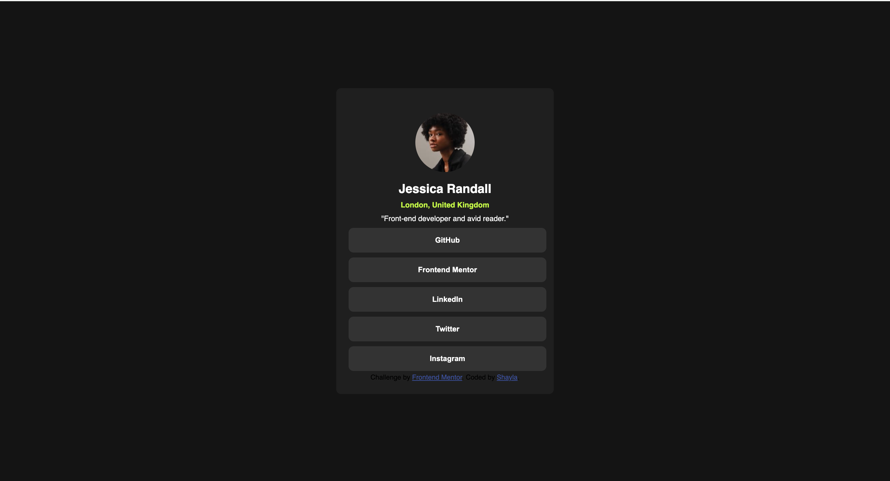

# Frontend Mentor - Social links profile solution

This is a solution to the [Social links profile challenge on Frontend Mentor](https://www.frontendmentor.io/challenges/social-links-profile-UG32l9m6dQ). Frontend Mentor challenges help you improve your coding skills by building realistic projects. 

## Table of contents

- [Overview](#overview)
  - [The challenge](#the-challenge)
  - [Screenshot](#screenshot)
  - [Links](#links)
- [My process](#my-process)
  - [Built with](#built-with)
  - [What I learned](#what-i-learned)
- [Author](#author)

**Note: Delete this note and update the table of contents based on what sections you keep.**

## Overview

This HTML page is designed as a personal profile for a fictional individual named Jessica Randall, showcasing her social media links and a brief description. It utilizes JavaScript for navigation and includes some basic styling.

### The challenge

Users should be able to:

- See hover and focus states for all interactive elements on the page

### Screenshot

### Links

- Live Site URL: (https://shaywalker5.github.io/social-links-profile-main/)

## My process

### Built with

- Semantic HTML5 markup
- CSS custom properties
- Flexbox
- CSS Grid
- [React](https://reactjs.org/) - JS library
- [Styled Components](https://styled-components.com/) - For styles

### What I learned

This project has provided a practical application of web development concepts, reinforcing my skills in HTML, CSS, and JavaScript. I also gained insights into best practices for web accessibility and the importance of a well-structured, user-friendly interface.

## Author

- LinkedIn - [Shayla Walker](https://www.linkedin.com/in/shaylavwalker)
- Frontend Mentor - [@shaywalker5](https://www.frontendmentor.io/profile/shaywalker5)

